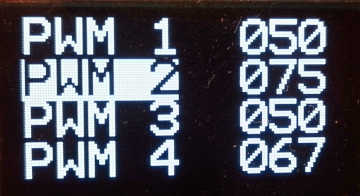
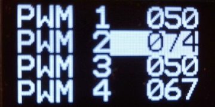

* **pwm_geber**\
Realisiert einen vier-Kanal pwm-Geber mit einem sh1106 OLED-Display und einem KY-040 Drehgeber\
Die eingestellten Werte bleiben nach Spannungsausfall erhalten\
Die Kanaele laufen mit 2Khz und werden in 1%-Schritten geaendert. Mit dem Drehgeber wird der
Kanal selektiert und mit einen Druck auf den Drehgeber ausgewählt,und der Wert mit dem Drehgeber geaendert.\
Mit widerholtem Druck auf den Drehgeber wird er Wert gespeichert.
Pinbelegung:\
sh1106 sda GP4\
sh1106 sck GP5\
KY-040 CKL GP16\
KY-040 DT GP17\
KY-040 SW GP18\
Ausgange:
PWM-Kanal 1 GP19\
PWM-Kanal 2 GP20\
PWM-Kanal 3 GP21\
PWM-Kanal 4 GP22\
\
Zum Selbskompilieren werden folgende Bibliotheken benoetigt:\
sh_1106\
drehgeber\
momefilo_flash

